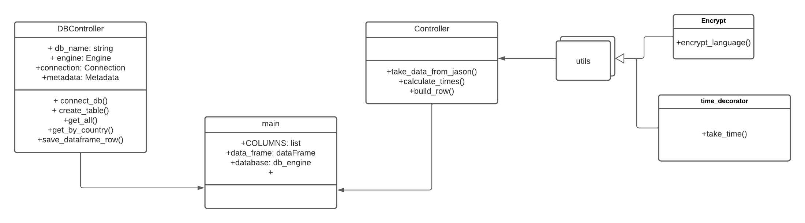
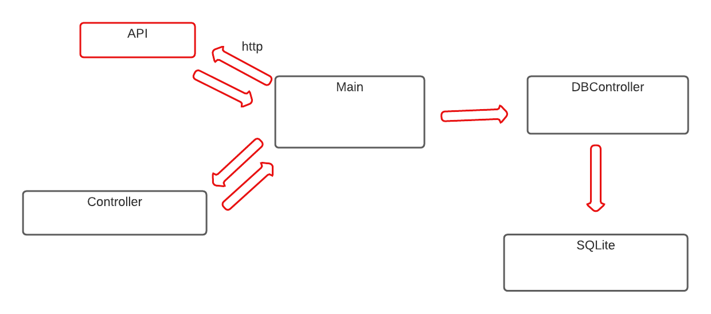

## About The Challenge
This is a python program that build a data table with ecnrypted language of a country taken from an API

### Solution Desing




### Built With
* Python 3.8
* SQLAlchemy
* sqlite3


### Prerequisites

* create a virtual environment using 
  ```sh
  python -m venv your-.env-name
  ```
* Activate your environment on Windows system
  ```sh
  %path-to-environment%\your-.env-name\Scripts\activate.bat
  ```
* Activate your environment on Linux systems
  ```sh
  source your-.env-name/bin/activate
  ```

### Installation
1. Clone the repository from github
   ```sh
   git clone https://github.com/Jriosv/challenge-1
   ```
2. Install Python 3.8 packages
   ```sh
   pip install -r requirements.txt

### Execution
* >python main.py
* >Please enter country name or enter 'exit' to finish the program:
* >Nota: cuando le das exit se crea el data.json


## Testing
all the following commands should have the virtualenv activated

1. To test the application we use pytest, just run the following command:
   ```sh
   pytest -v
   ```


